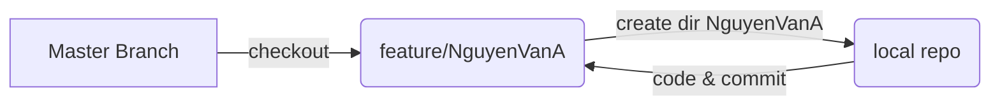

# Ansible-TOAA01
Ansible labs for Course TOAA01

## Description
This is the public repo that uses for students in class TEL4VN-TOAA01.Each student create a feature branch with name feature/Name-Of-Student and create a separate dir for each roles.

**Note:**  **Do not commit on master branch** 

This is example flow chart:

